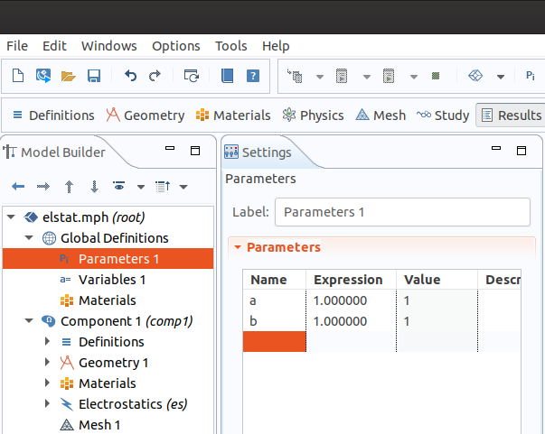
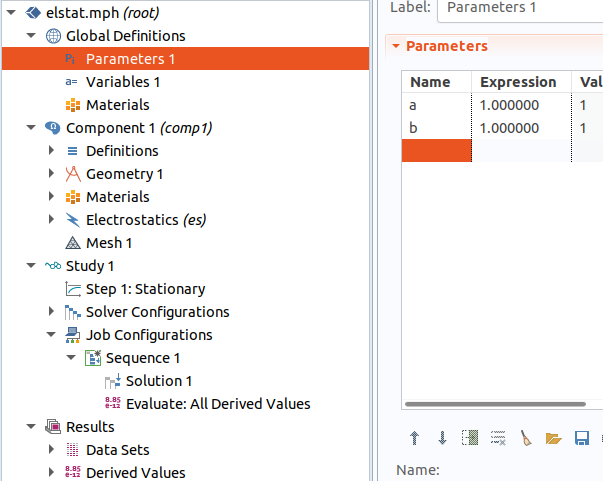
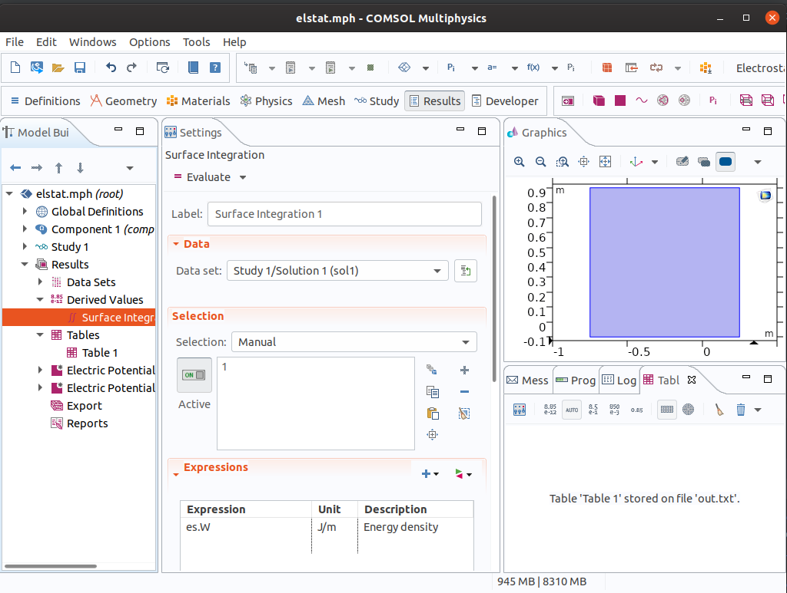
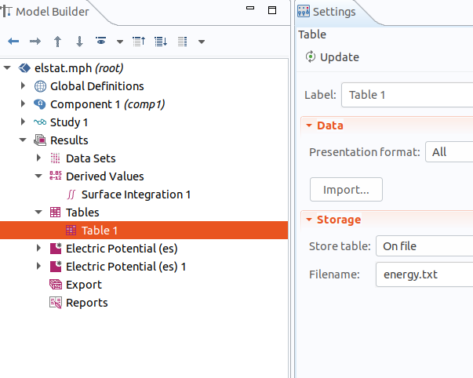

.. index::
   single: Single objective problem with Comsol Multiphysics

Capacitor - Optimization problem with Comsol Multiphysics
=========================================================

This example demonstrates usage of artap together with the commercial software Comsol Multiphysics.
The problem itself seems to be somewhat artifitial. The reason is to demontrate procedure
on simple example. Suppose we design a plane capacitor and we require capacity :math:`C = 5` pF. 
Our design variables are the width of dielectricum :math:`a` and the hight of dielectricum :math:`b`.

Prepare model in Comsol Multiphysics
------------------------------------

The firs think is preparing the model in Comsol Multiphysics. We have to create parameters with same name 
both in the Comsol Multiphysics and consequently in Artap:

|

Then it is necessary to add sequence to the Study:

|

The next step is calculate required value 
which is our case energy stored in capacitor. 
This can be done using derived values. 

|

After runing simulation the Table is created. The table must be saved in the file.
The artap will use this file.

In this moment the model is prepared for using with Artap. 
We recommend clear solutions before saving model.

Create Artap problem file
-------------------------

The class **Problem** is composed by standard way. At first make You sure, that parameters have the same name in the **Problem class** and in Comsol model.

.. code-block:: python

    # Parameters must be defined in the Comsol model
    self.parameters = [{'name': 'a', 'initial_value': 10, 'bounds': [0.1, 100]},  # parameters a, b must be positive
                        {'name': 'b', 'initial_value': 10, 'bounds': [0.1, 100]}]

It is necessary to specify name of the  model file  and file produced by Comsol Multiphysics.
   
.. code-block:: python
    
    self.costs = [{'name': 'F1', 'criteria': 'minimize'}]
    self.output_files = ["energy.txt"]

    # Executor serves for calling the Comsol Multiphisics
    self.executor = LocalComsolExecutor(self,
                                        problem_file="./capacitor.mph",   # File with the model
                                        output_files=self.output_files)   # file with results produced by Comsol

------------------------------------------------------------
Automatically generated docummentation from the example file
------------------------------------------------------------

.. automodule:: artap.examples.capacitor
    :members:

