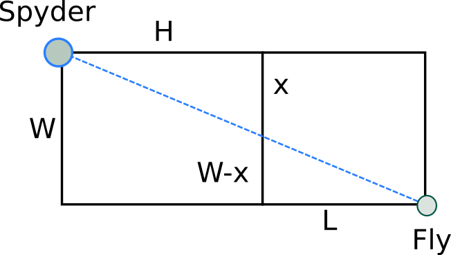

.. index::
   single: Examples

Examples
========

=====================
Simple usage of Artap
=====================

As a

Problem 1:
----------

A spider (*S*) sits in one corner of a cuboid room, measuring **H** by **W** by **L**, and a fly, (*F*), sits in the opposite
corner. By travelling on the surfaces of the room the, what is the shortest “straight line” distance from (*S*) to (*F*)?
The puzzle was originally posed in an English newspaper [CIT1]_.

As it can be seen from the image, in this simple case, the problem can be formulated as a single objective, free optimization problem, where the task is to find the optimal value of *x*.

.. math::

  sqrt(x[0] ^ 2 + H ^ 2) + sqrt((W - x[0])^2 + L^2)

* blablablablablablablablablablablablablablablabla
* blablablablablablablablablablablablablablablabla
* blablablablablablablablablablablablablablablabla
* blablablablablablablablablablablablablablablabla

.. [CIT1] Gardner, M. "Mathematical Games: About Henry Ernest Dudeney, A Brilliant Creator of Puzzles." Sci. Amer. 198, 108-112, Jun. 1958.