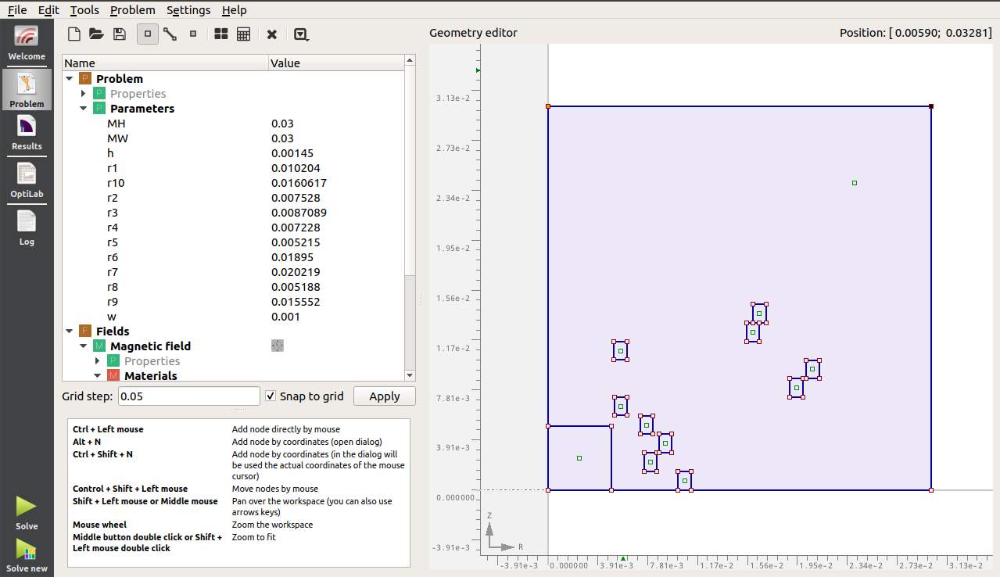

.. index::
   single: Multi-objective Pareto-Design problem

Solving a multi-obejctive TEAM Benchmark problem with Agros and Artap
----------------------------------------------------------------------

In this Tutorial, the Pareto-Optimal solution of a solenoid design problem is solved together by Agros and Artap.
Firstly, a parametric model is build with Agros, then this model is exported into Artap and the model is solved by

----------------------------------------------------
Problem Definition
----------------------------------------------------

The goal of the benchmark problem is to optimize the layout of a solenoid and provide a uniform magnetic field in the given region [PDB]_.
The solenoid has 20 turns, while the dimensions of the turns and the variation of their positions in the z-direction are fixed.
The height and the width parameters of the modeled conductors are 1.5 mm and 1.0 mm during the calculations. The inner radius of the
turns (radii) can be varied from 5 mm to 50 mm in the r-direction. All turns carry a direct current of value I, the
current density in the conductors are J = 2 A/mm 2 . The width and the height of the controlled region is 5 mm in the
r and the z directions.

----------------------------------------------------
Objective of the Single-Objective Optimization Task
----------------------------------------------------

The fitness function for single-objective problem is derived from designing the geometry of coils that minimizes the discrepancy between the prescribed valued $\vec{B}_0$ and actual distribution of $\vec{B}$ in the region of interest.

.. math::
    F_1(r) = \sup_{q=1,n_{p}} |\vec{B}(r_q,z_q)-\vec{B}_0(r_q,z_q)|,

where

.. math::
    B_0(r_q,z_q) = 0.2, mT

is the prescribed value of magnetic flux density and n_p is the number of points.

----------------------------------------------------
Objectives of the Multi-Objective Optimization Task
----------------------------------------------------

In the case of the multi-objective problem, the following functions are minimized: the sensitivity function can be expressed as

.. math::
    F_2(r) = \sup_{q=1,n_{p}} (|\vec{B}(r_q,z_q)-\vec{B}(r_q+\Delta r,z_q)| + |\vec{B}(r_q,z_q)-\vec{B}(r_q-\Delta r,z_q)|).

The power loss which is related to the sum of the radii can be written in the form

.. math::

    F_3(r) = \sum_{q=1}^N R(r_q),

where R(rq) are the radii of the conductors.

----------------------------------------------------
Definition of this Optimization Task in Artap
----------------------------------------------------

The solved optimization problem contains the following 10 parameters, with the above mentioned search domains.
The problem is solved for F1 and F2 functions in this example.

.. code-block:: python

    def set(self):

        self.name = "Agros-solution"

        self.parameters = [{'name': 'x1', 'bounds': [5.01e-3, 50e-3]},
                           {'name': 'x2', 'bounds': [5.01e-3, 50e-3]},
                           {'name': 'x3', 'bounds': [5.01e-3, 50e-3]},
                           {'name': 'x4', 'bounds': [5.01e-3, 50e-3]},
                           {'name': 'x5', 'bounds': [5.01e-3, 50e-3]},
                           {'name': 'x6', 'bounds': [5.01e-3, 50e-3]},
                           {'name': 'x7', 'bounds': [5.01e-3, 50e-3]},
                           {'name': 'x8', 'bounds': [5.01e-3, 50e-3]},
                           {'name': 'x9', 'bounds': [5.01e-3, 50e-3]},
                           {'name': 'x10', 'bounds': [5.01e-3, 50e-3]}]

        self.costs = [{'name': 'F1', 'criteria': 'minimize'},
                      {'name': 'F2', 'criteria': 'minimize'}]

The evalueate() function is defined by the aid of the exported python script from the Agros model.

----------------------------------------------------
Problem definition in Agros
----------------------------------------------------

The problem is defined by the parametric functions of Agros. Where, at first the parameters should be defined in the graphical interface.
Then the positions of the different points are defined by the aid of these parametric values.
The solution file as added to the example library, where this solution can be checked.

If the geometry and the problem definition is set in the framework, the model can be exported by the Problem Menu > Create Script From Model function.
The created script can be inserted into the *evaluate()* function.  Where, we have to define the relation between the parameters of the Artap and the Agros problems.
This is made by the following code snippet:

.. code-block:: python

        x = x.vector

        # problem
        problem = a2d.problem(clear=True)
        problem.coordinate_type = "axisymmetric"
        problem.mesh_type = "triangle"

        problem.parameters["MH"] = 0.04
        problem.parameters["MW"] = 0.1
        problem.parameters["h"] = 0.00145
        problem.parameters["r1"] = x[0]
        problem.parameters["r10"] = x[9]
        problem.parameters["r2"] = x[1]
        problem.parameters["r3"] = x[2]
        problem.parameters["r4"] = x[3]
        problem.parameters["r5"] = x[4]
        problem.parameters["r6"] = x[5]
        problem.parameters["r7"] = x[6]
        problem.parameters["r8"] = x[7]
        problem.parameters["r9"] = x[8]
        problem.parameters["w"] = 0.001

.. image:: figures/TEAM_Solution_AGROS.png
   :width: 400px
   :height: 300px
   :align: center

Here, the first line, just gets the list of the optimized parameters from the *Individual.vector*, then gives the Artap parameters to every *problem.paremeter*.
Then, we can use the python wrapper of Agros to get back the solution of the magnetic field and using these local values, we can calculate the values of the goal functions
in a nx x ny = 8 x 8 = 64 point matrix:

.. code-block:: python

        computation = problem.computation()
        computation.solve()

        solution = computation.solution("magnetic")

        B0 = 2e-3

        dxy = 0.5e-3
        nx = 8
        ny = 8
        dx = (5e-3 - dxy) / (nx - 1)
        dy = (5e-3 - dxy) / (ny - 1)

        f1 = 0.0
        f2 = 0.0
        f3 = 0.0
        for i in range(0, nx):
            xx = dxy + i * dx
            for j in range(0, ny):
                yy = dxy + j * dy

                point = solution.local_values(xx, yy)
                Br = point["Brr"]
                Bz = point["Brz"]

                Bp1s = math.sqrt((Br - 0.0) ** 2 + (Bz - B0) ** 2)
                f1 = max(f1, Bp1s)

                Bp2 = math.sqrt((Brp - Br) ** 2 + (Bzp - Bz) ** 2) + math.sqrt((Brm - Br) ** 2 + (Bzm - Bz) ** 2)
                f3 = max(f2, Bp2)

        f2 = sum(x) * 1e3

        return [f1, f2, f3]

Now, our only task is to run() the defined optimization task. The used algorithm is NSGAII, where its parameters, the number of the maximum population and the population size is set.
Then we can run the calculation.

.. code-block:: python

    problem =  AgrosSimple()

    algorithm = NSGAII(problem)
    algorithm.options['max_population_number'] = 100
    algorithm.options['max_population_size'] = 100
    algorithm.run()

Every calculation result saved into the problem class during the calculation. It can be simply post-processed by the *Results* class, which contains simple functions for plotting the results
.. code-block:: python

    # Post - processing the results
    # reads in the result values into the b, results class
    b = Results(problem)
    b.pareto_values()

.: [PDB] P. Di Barba, M. E. Mognaschi, D. A. Lowther, and J. K. Sykulski, “A benchmark TEAM problem for multi-objective Pareto
optimization of electromagnetic devices,” IEEE Trans. Magn., vol. 54, no. 3, pp. 2–5, 2018, doi: 10.1109/TMAG.2017.2750901.